<p align='center'>
  
</p>

# Hotpotato
Hotpotato is a recipe portfolio App that assists users to discover and comment new recipes. It is a fullstack React App made with a Redux state manager and a backend using Python, Flask, SQL-Alchemy, and PostgresSQL. 

* View the <a href='https://hotpotato-app.herokuapp.com/'>Hotpotato</a> App Live
* It is modeled after the <a href='https://www.behance.net/'>Behance</a> App
* Contains recipes for Vegetarians, Vegans, and Gluten-Free diets.

* Reference to the Hotpotato <a href='https://www.github.com/nicopierson/hotpotato/wiki'>Wiki Docs</a>

| Table of Contents |
| ----------------- |
| 1. [Features](#features) |
| 2. [Installation](#installation) |
| 3. [Technical Implementation Details](#technical-implementation-details) |
| 4. [Future Features](#future-features) |
| 5. [Contact](#contact) |
| 6. [Special Thanks](#special-thanks) |


## Technologies
* <a href="https://developer.mozilla.org/en-US/docs/Web/JavaScript"></a>
* <a href="https://www.postgresql.org/"></a>
* <a href="https://nodejs.org/"></a>
* <a href="https://reactjs.org/"></a>
* <a href="https://redux.js.org/"></a>
* <a href="https://developer.mozilla.org/en-US/docs/Web/CSS"></a>
* <a href="https://www.python.org/"></a>
* <a href="https://flask.palletsprojects.com/"></a>
* <a href="https://www.heroku.com/home"></a>


## Features

### Sign In and Sign Up
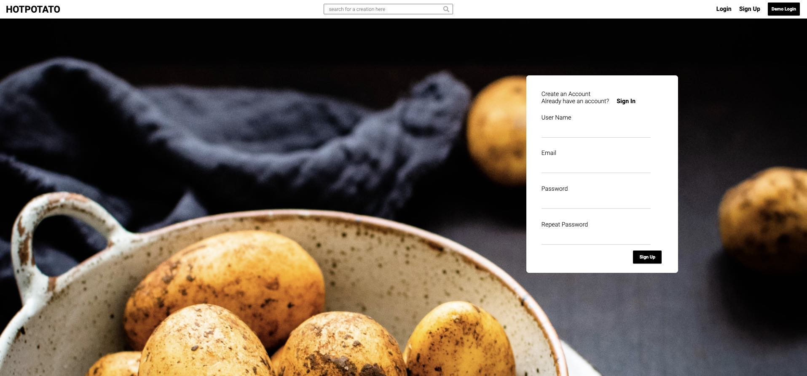
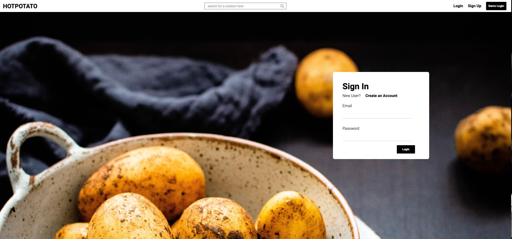

### Feed Page
Hotpotato feed displays all recipes and chefs
Discover and search for new recipes
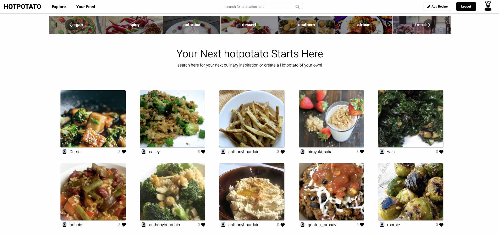

### Sort Recipes in Feed
Sort Recipes based on a category
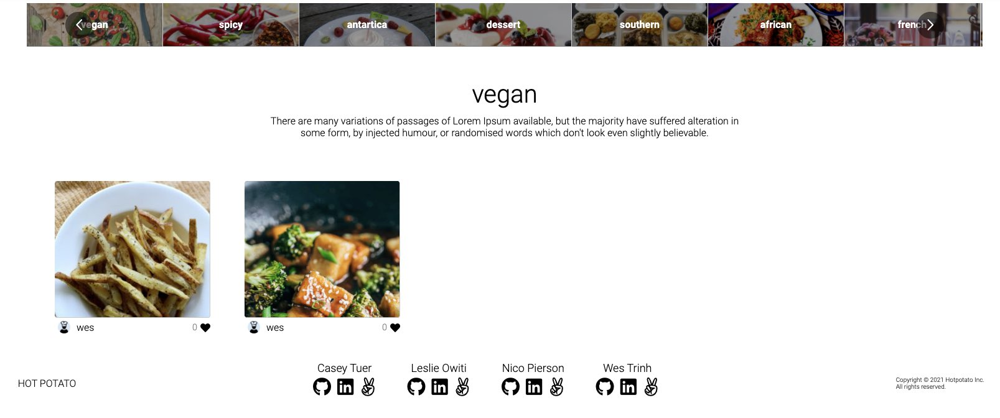

### View Recipe
Single recipe of name, photos, ingredients, directions, and comments


### Add Recipe
Add a new recipe to the database
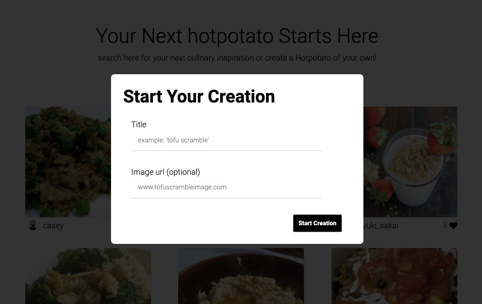
Cancel adding recipe
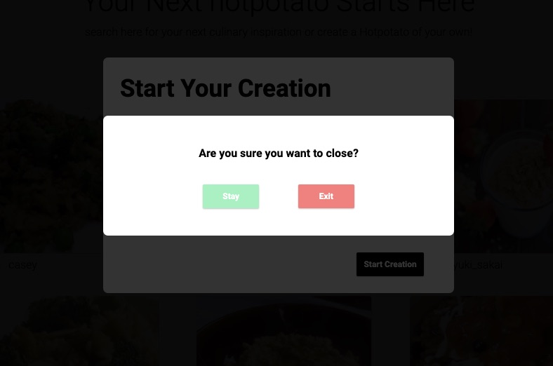

### Create, Read, Update, Delete Recipe Preparations
View preparations to make recipe
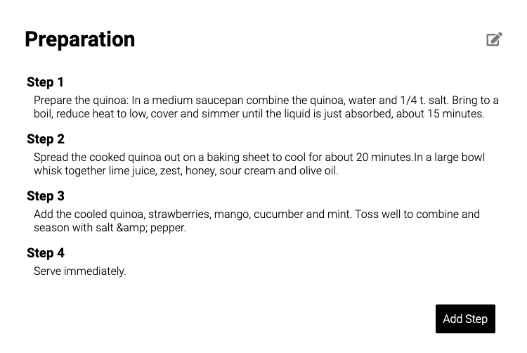
Edit and Add a recipe preparation(s) in the database
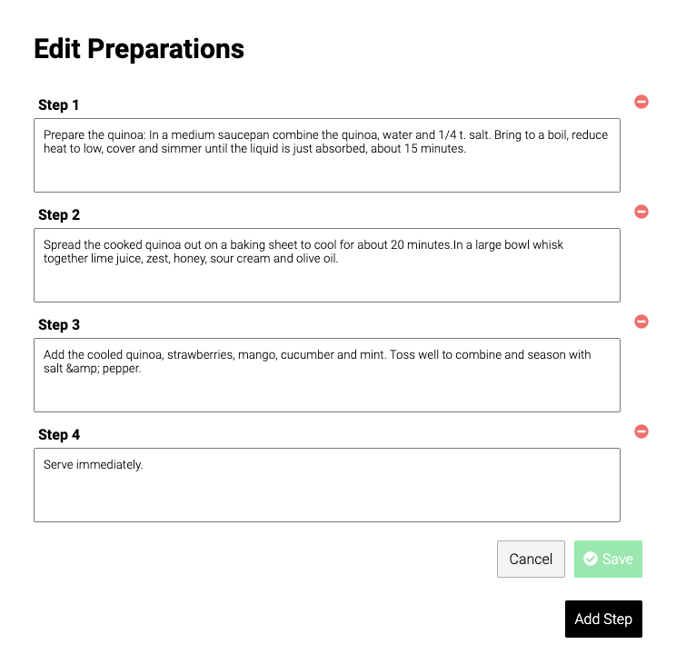


### Create, Read, Update, Delete Recipe Ingredients
View Ingredients to make recipe
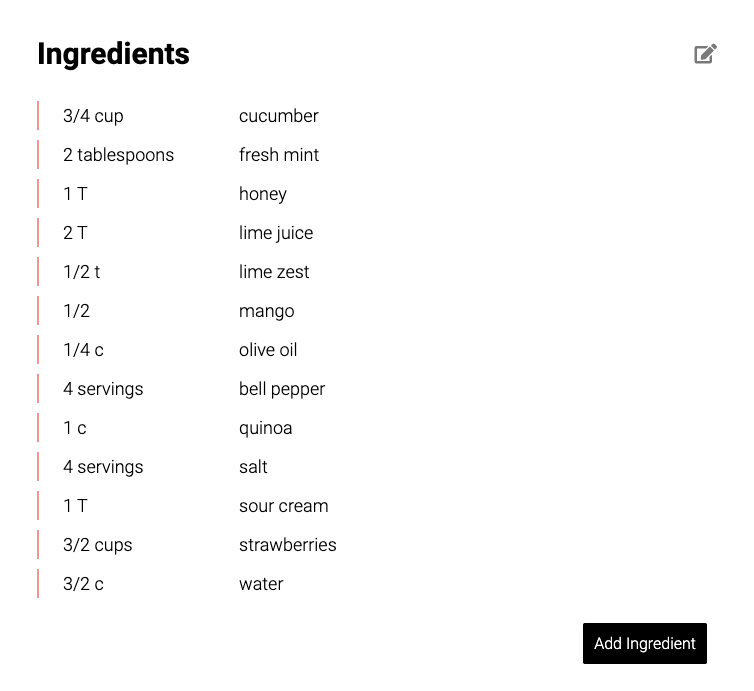
Edit and Add a recipe preparation(s) in the database
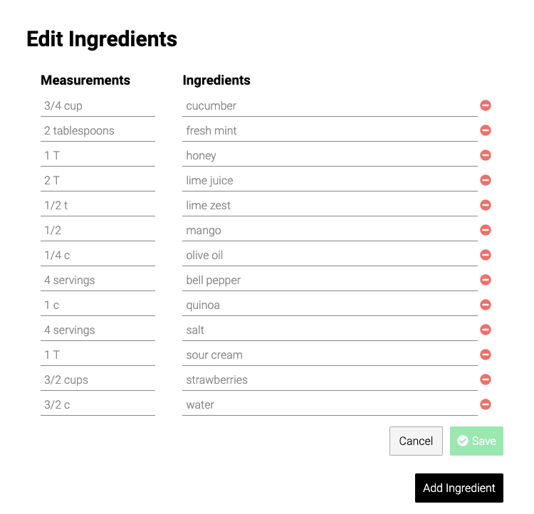
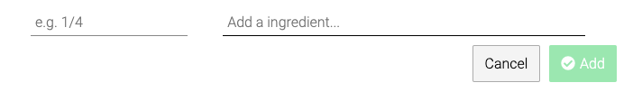

### Comment
Users can add comments for a recipe
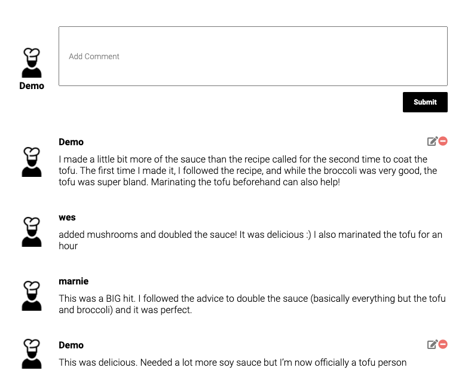

### Follow
Follow or unfollow a chef

<span>
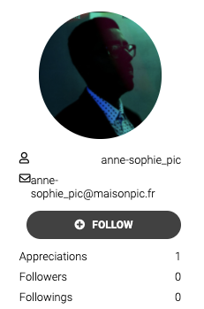
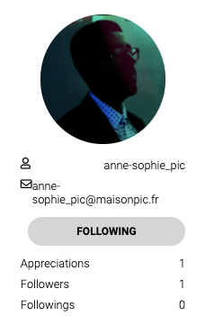
</span>


## Installation
To build/run project locally, please follow these steps:

1. Clone this repository

```shell
git clone https://github.com/nicopierson/hotpotato.git
```

2. Install Pipfile dependencies and create the virtual environment
```shell
pipenv install
```

2. Install npm dependencies for the `/react-app`

```shell
cd react-app
npm install
```

3. In the `/` root directory, create a `.env` based on the `.env.example` with proper settings

4. Setup your PostgreSQL user, password and database and ensure it matches your `.env` file

5. In the root folder, create the database by running in the terminal:
```shell
flask db create
```

6. In the root folder, migrate tables to the database by running in the terminal:
```shell
flask db migrate
```

7. In the root folder, seed the database by running in the terminal:
```shell
flask seed all
```

8. Start the flask backend in the `/` root directory
```shell
flask run
```

9. Start the frontend in the `/react-app` directory

```javascript
npm start
```


## Technical Implementation Details

### Follow
Follow feature was a key element for our project and we implemented by creating a self-referential table from the Users table. It was also necessary to add class methods to follow and to unfollow a user or chef. It was challenging to integrate the table and append or remove users to the table.

Part of our user model is shown below:

```python
follows = db.Table(
  "follows",
  db.Column("user_id_follow_owner", db.Integer,
            db.ForeignKey("users.id")),
  db.Column("user_id_follower", db.Integer, db.ForeignKey("users.id"))
)
followers = db.relationship(
  "User",
  secondary=follows,
  primaryjoin=(follows.c.user_id_follow_owner == id),
  secondaryjoin=(follows.c.user_id_follower == id),
  backref=db.backref("follows", lazy="dynamic"),
  lazy="dynamic"
)

def follow(self, user):
  if not self.is_following(user):
    self.follows.append(user)
    return user
  return False

def unfollow(self, user):
  if self.is_following(user):
    self.follows.remove(user)
    return user
  return False
```

In order to connect the backend to the frontend, we connected the `follows` api routes to update the following in the redux store. When the Follow component button is clicked, either a removeFollowing or createFollowing dispatch action is called to update the follow and profile slice of state in redux store. As a result the Profile page will re-render because React notices a change in the profile state and updates the followers attribute and the follow button.

```javascript
export const removeFollowing = (id) => async (dispatch) => {
    const response = await fetch(`/api/follows/users/${id}`, {
        method: 'DELETE',
    });

    if (response.ok) {
        await dispatch(deleteFollowing(id));
        await dispatch(getProfile(id));
        return response;
    } else {
        return ['An error occurred. Please try again.']
    }
}

export const createFollowing = (id) => async (dispatch) => {
    const response = await fetch(`/api/follows/users/${id}`, {
        method: 'POST',
    });

    if (response.ok) {
        const { following } = await response.json();
        await dispatch(addFollowing(following));
        await dispatch(getProfile(id));
        return following;
    } else {
        return ['An error occurred. Please try again.']
    }
}
```

### Integrating React Carousel
In order to show more than main thumbnail, we integrated a third-party react component.

Code snippet is shown here:

```javascript
<Carousel 
  className='recipe-carousel' 
  renderArrow={arrows} 
>
  { getPhotos()?.map(recipe => (
    
  ))}

  { getVideos()?.map(video => (
      <ReactPlayer url={video}></ReactPlayer>
    ))
  }

  {addVideo &&
    <ReactPlayer url={videoUrl}></ReactPlayer>
  }
</Carousel>
```


## Future Features

1. __Search__ - search recipes or chefs

2. __Edit Profile__ - users edit profile info and add banner

3. __Add Tags__ - add tags to recipes and profile


## Contact

### Casey Tuer
<a href="https://www.linkedin.com/in/caseytuer/"></a>
<a href="#"></a>
<a href="https://www.linkedin.com/in/caseytuer/"></a>

caseytuer@gmail.com

### Leslie Owiti
<a href="https://www.linkedin.com/in/leslie-owiti-0b447952/"></a>
<a href="#"></a>
<a href="https://github.com/leslieowititech"></a>

leslieowiti@yahoo.com

### Nico Pierson
<a href="https://www.linkedin.com/in/nico-pierson/"></a>
<a href="https://angel.co/u/nico-gerard-pierson"></a>
<a href="https://github.com/nicopierson"></a>

nicogpt@gmail.com

### Wes Trinh
<a href="https://www.linkedin.com/in/wes-trinh-28b526220/"></a>
<a href="https://angel.co/u/wes-trinh"></a>
<a href="https://github.com/WesTrinhKL"></a>

westrinh00@gmail.com


## Special Thanks
* Mentors who have given us their time and effort: [Zach](https://github.com/zdwatts), [Ed](https://github.com/edherm), and [Javier](https://github.com/javiermortiz) 
